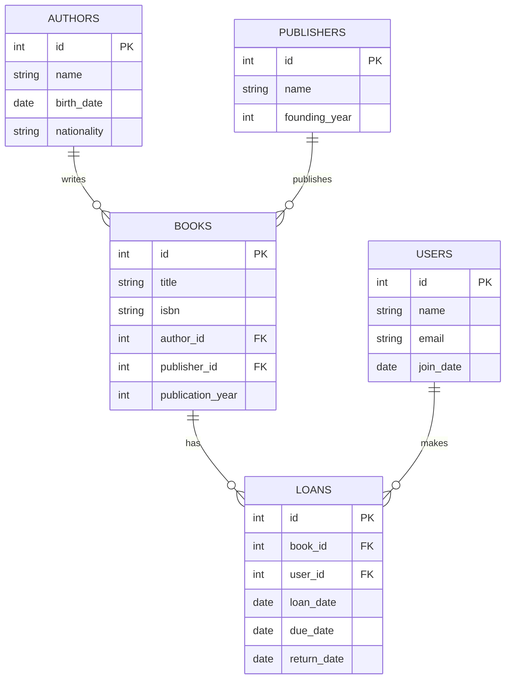
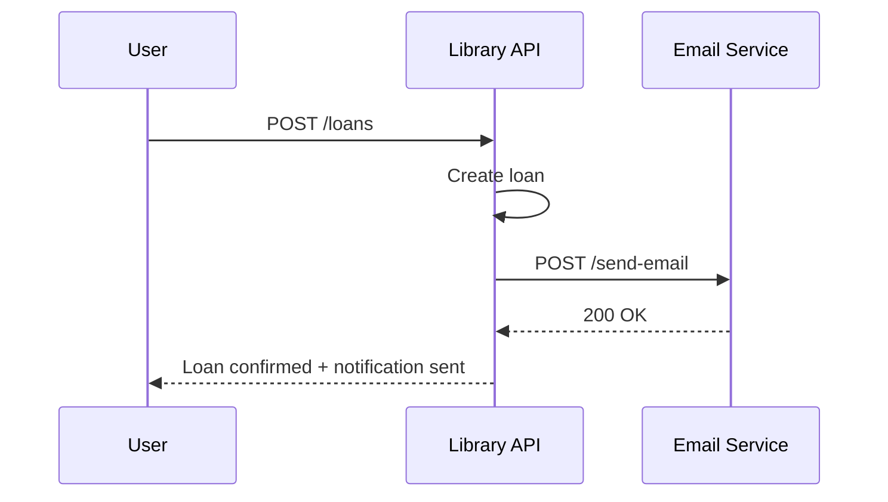

# 📚 Library API

A RESTful API built with **FastAPI** for managing a library system. It allows you to manage authors, books, publishers, users, and loans.

## 🧱 Architecture

The application follows a **layered architecture**:

- **Domain:** data models (`app/models`)
- **Persistence:** data access layer using repositories (`app/repositories`)
- **Application:** business logic (`app/services`)
- **Presentation:** HTTP endpoints (`app/api/routes`)

## 🚀 Stack

- Python 3.10+
- FastAPI
- SQLModel + SQLite
- Alembic (migrations)
- Swagger (automatic documentation)

---

## 🔧 Setup

### 1. Clone the repository
```bash
git clone https://github.com/loncho-richard/library-api.git
cd library-api
```

### 2. Create a virtual environment
```bash
python -m venv env
source env/bin/activate  
# On Windows: 
env\Scripts\activate
```

### 3. Install dependencies
```bash
pip install -r requirements.txt
```

### 4. Run the development server
```bash
fastapi dev app/main.py
```

---

## 👥 Demo Users (Preloaded)

| Name       | Email            | Password      |
|------------|------------------|---------------|
| Jhon Doe   | jhon@example.com | password123   |
| Jane Smith | jane@example.com | securepass456 |

---

## 🧪 Main Endpoints

| Method | Endpoint          | Description                  |
|--------|-------------------|------------------------------|
| POST   | /books            | Create a new book            |
| GET    | /books            | List all books               |
| GET    | /books/{id}       | Get book by ID               |
| PUT    | /books/{id}       | Update a book                |
| DELETE | /books/{id}       | Delete a book                |
| POST   | /books/upload-csv | Upload books csv             |
| GET    | /authors          | List all authors             |
| POST   | /authors          | Create a new author          |
| GET    | /authors/{id}     | Get author by ID             |
| PUT    | /authors/{id}     | Update an author             |
| DELETE | /authors/{id}     | Delete an author             |
| GET    | /publishers       | List all publishers          |
| POST   | /publishers       | Create a new publisher       |
| GET    | /publishers/{id}  | Get publisher by ID          |
| PUT    | /publishers/{id}  | Update a publisher           |
| DELETE | /publishers/{id}  | Delete a publisher           |
| GET    | /user             | List all users               |
| POST   | /user             | Create a new user            |
| GET    | /user/{id}        | Get user by ID               |
| PUT    | /user/{id}        | Update an user               |
| DELETE | /user/{id}        | Delete an user               |
| GET    | /loans            | List all loans               |
| POST   | /loans            | Create a new loan            |
| GET    | /loans{id}        | Get loan by ID               |
| PUT    | /loans{id}        | Update a loan                |
| DELETE | /loans{id}        | Delete a loan                |
| GET    | /health           | Service health check         |
| GET    | /version          | API version                  |
| POST   | /login            | Login for access token       |
| POST   | /refresh          | Refresh access token         |

---

## 📊 Database Diagram (Mermaid)



---

## 🔄 External Integration Diagram (Mermaid)



---

## 🧠 Data Transformation

The API responses are **denormalized**:

- `BookRead` includes `author_name`, `publisher_name`, `is_available`, and `due_date`
- `LoanRead` includes `book_title` and `user_name`
- This reduces the need for additional client-side queries

---

## 📌 Technical Decisions

- `SQLModel` was chosen for its blend of Pydantic + SQLAlchemy
- Services contain business logic and data transformation
- The code uses **type hints** and is structured for testability
- Migrations are managed with **Alembic**
- The structure is scalable and ready for extensions

---

## ✅ Requirements Checklist

- [x] Full CRUD with FastAPI
- [x] DB with 5 related tables
- [x] Entity-relationship diagram (Mermaid)
- [x] Sequence diagram (Mermaid)
- [x] Transformed response data
- [x] Healthcheck and version endpoint
- [x] Layered architecture
- [x] ORM usage
- [x] Swagger documentation and full README

---

## 🧪 Optional Future Improvements

- [x] JWT Authentication
- [x] Pagination
- [x] Logging
- [x] CSV bulk upload for books
- [x] Dependency injection 

---

## 📫 Contact

Developed by Carlos Richardson for a Backend Junior technical challenge.